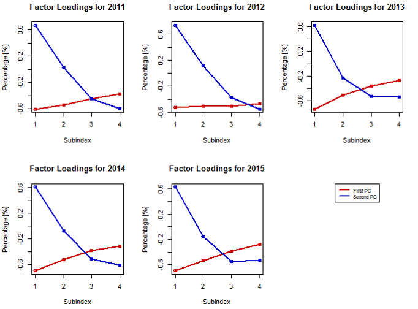
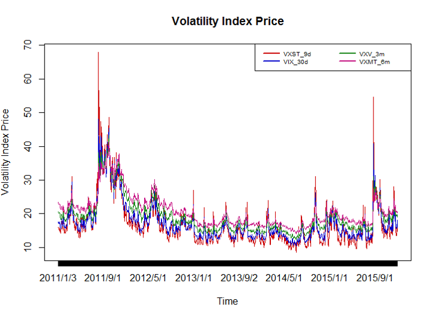

[](http://quantlet.de/index.php?p=info)

## [](http://quantlet.de/) **XFG_iv_sp500** [](http://quantlet.de/d3/ia)

```yaml

Name of Quantlet: XFG_iv_sp500

Published in: has not been published

Description: 'Uses principle component analysis method to analyze different types of 
implied volatility expectation index of S&P500 (including VXST(9-day), VIX(30-day), 
VXV(3-month), VXMT(6-month)) in year 2011 to 2015, computes the variance and cumulated 
variance explained by principle components, compares the factor loadings of first and 
second principle components through year 2011 to 2015.'

Keywords: 'plot, graphical representation, principal-components, variance, 
covariance, dimension-reduction,  eigenvalues, eigenvectors, factor-loadings, 
implied-volatility, pca, principal-component-analysis, spectral-decomposition'

Author: Jinhua Yang

Datafile: sp500iv_11.csv, sp500iv_12.csv, sp500iv_13.csv, sp500iv_14.csv, sp500iv_15.csv

Output: variance and cumulated variance explained

Example: Comparison of factor loadings of first and second principle components through year 2011 to 2015.

```





```r
# clear history
rm(list = ls(all = TRUE))
graphics.off()

# setwd('D:...') set working directory

# import data
for (i in 1:5) {
    a = paste("sp500iv_1", i, sep = "")
    assign(paste("iv_1", i, sep = ""), read.csv(paste(a, ".csv", sep = ""), header = T, sep = ","))
}

#plot time series of all the volatility index price
iv = rbind(iv_11, iv_12, iv_13, iv_14, iv_15)
date = as.Date(iv$Date, "%Y/%m/%d")
plot(iv$VXST_9d, type = "l", xlab = "Time", ylab = "Volatility Index Price", col = "red3", 
    xaxt = "n", main = "Volatility Index Price")
lines(iv$VIX_30d, col = "blue3")
lines(iv$VXV_3m, col = "forestgreen")
lines(iv$VXM_6m, col = "mediumvioletred")
axis(1, at = iv$Date, labels = format(date, "%Y/%m"), las = 0)
legend("topright", names(iv)[2:5], lwd = 2, col = c("red3", "blue3", "forestgreen", "mediumvioletred"), 
    cex = 0.6, ncol = 2, x.intersp = 0.5, y.intersp = 0.7)


# covariance
cov = array(0, dim = c(4, 4, 5))
cov[, , 1] = cov(iv_11[, 2:5])
cov[, , 2] = cov(iv_12[, 2:5])
cov[, , 3] = cov(iv_13[, 2:5])
cov[, , 4] = cov(iv_14[, 2:5])
cov[, , 5] = cov(iv_15[, 2:5])

value = matrix(rep(0), nrow = 4, ncol = 5)
VarExpl = matrix(rep(0), nrow = 4, ncol = 5)
CumVarExpl = matrix(rep(0), nrow = 4, ncol = 5)
vector = array(0, dim = c(4, 4, 5))

for (i in 1:5) {
    value[, i] = eigen(cov[, , i])$values
    vector[, , i] = eigen(cov[, , i])$vectors
    VarExpl[, i] = value[, i]/(matrix(1, 1, 4) %*% value[, i])  #percentage of variance explained for every PC
    CumVarExpl[, i] = cumsum(value[, i]/(matrix(1, 1, 4) %*% value[, i]))  #cumulated percentage of variance explained
}


# output

VarExpl = as.data.frame(VarExpl)
CumVarExpl = as.data.frame(CumVarExpl)
year = c("2011", "2012", "2013", "2014", "2015")
names(VarExpl) = year
names(CumVarExpl) = year
write.csv(VarExpl, "Variance Explained.csv")
write.csv(CumVarExpl, "Cumulated Variance Explained.csv")


# compare the factor loading of each year

layout(matrix(c(1, 2, 3, 4, 5, 6), 2, 3, byrow = TRUE))
for (i in 1:5) {
    plot(vector[, 1, i], type = "l", col = "red3", xlab = "Subindex", xaxt = "n", ylab = "Percentage [%]", 
        main = paste("Factor Loadings for 201", i, sep = ""), lwd = 2, ylim = c(min(vector[, 
            1:2, i]), max(vector[, 1:2, i])))
    points(vector[, 1, i], col = "red3", lwd = 2, pch = 1)
    lines(vector[, 2, i], col = "blue3", lwd = 2)
    points(vector[, 2, i], col = "blue3", lwd = 2)
    axis(1, at = c(1:4), las = 0)
    
}
plot(0, xaxt = "n", yaxt = "n", bty = "n", pch = "", ylab = "", xlab = "")
legend("top", c("First PC", "Second PC"), lwd = 2, col = c("red3", "blue3"), cex = 0.8)

```
